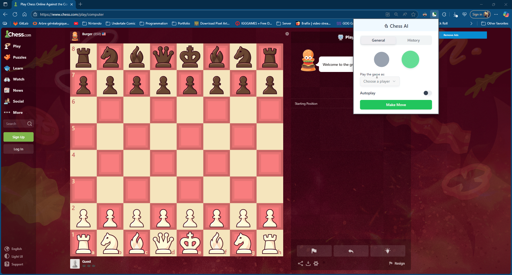

# Chess AI
Chess AI hooks into chess.com and automatically plays every move of your game. Once enabled during a match, our extension reads the current board position and uses an LLM to select and click the best move each turn. The user never has to make a move. The AI does it all.



## Develop

### Requirements

- OpenAI API key
- PostgreSQL database

### Steps

1. Install dependencies (from project root):

   ```bash
   npm i
   ```

2. In **apps/backend**, create a **.env** file:

   ```typescript
   OPENAI_API_KEY = your_openai_api_key;
   DATABASE_URL = your_postgres_url;
   ```

3. Back in the root, run:

   ```bash
   npm run dev
   ```

4. In Chrome, open **chrome://extensions/**
   - Enable Developer mode
   - Click **Load unpacked** and select apps/frontend/dis
